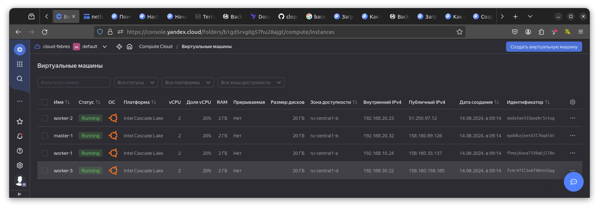
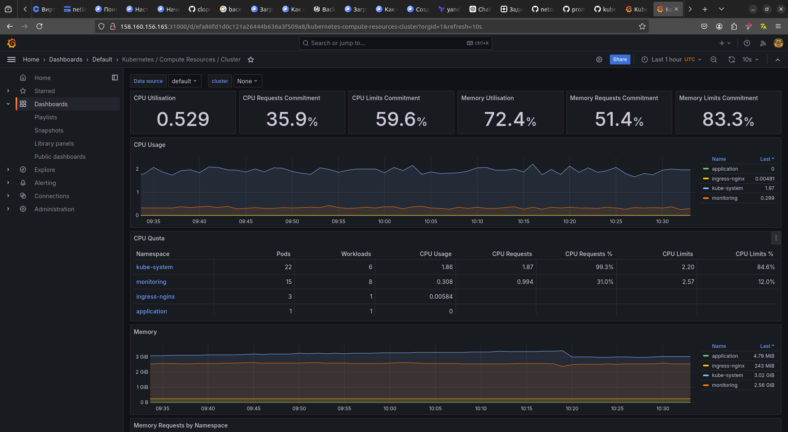

# Дипломный практикум в Yandex.Cloud


---
## Цели:

1. Подготовить облачную инфраструктуру на базе облачного провайдера Яндекс.Облако.
2. Запустить и сконфигурировать Kubernetes кластер.
3. Установить и настроить систему мониторинга.
4. Настроить и автоматизировать сборку тестового приложения с использованием Docker-контейнеров.
5. Настроить CI для автоматической сборки и тестирования.
6. Настроить CD для автоматического развёртывания приложения.

---
## Этапы выполнения:


### Создание облачной инфраструктуры

Предварительная подготовка к установке и запуску Kubernetes кластера.

Подготовка инфраструктуры с использованием terraform ([конфигурационные файлы](terraform))   
Для удобства создан файл [deploy.sh](deploy.sh) - создаёт сервисный аккаунт, бакет, бэкэнд и запускает создание инфраструктуры

---
### Создание Kubernetes кластера

#### Установка Kubernetes кластера на ВМ.  
   Для установки кластера будет использован [Kubespray](https://kubernetes.io/docs/setup/production-environment/tools/kubespray/). Заполняем файл  [hosts.yaml](ansible%2Fhosts.yaml) на основании адресов созданной инфраструктуры. 
   В файле [k8s-cluster.yml](ansible%2Fgroup_vars%2Fk8s_cluster%2Fk8s-cluster.yml) выставляем параметр ```kubeconfig_localhost: true``` для сохранения kubeconfig в каталог ./artifacts
   Запускаем создание кластера используя [hosts.yaml](ansible%2Fhosts.yaml) в качестве inventory файла. По завершении установки копируем содержимое файла ./artifacts/admin.conf в файл ~/.kube/config, проверяем подключение к кластеру
    

  

---
### Создание тестового приложения

   Создадим отдельный git репозиторий с простым nginx конфигом https://github.com/Hovard777/diplom-app.  
   Подготовим Dockerfile для создания образа приложения. 
   Отправим образ в https://hub.docker.com/  


---
### Подготовка cистемы мониторинга и деплой приложения

Задеплоил систему мониторинга, используя пакет kube-prometheus. 
Для настройки доступа к Grafana сконфигурируем service [grafana-service.yaml](monitoring%2Fmanifests%2Fgrafana-service.yaml) и [grafana-networkPolicy.yaml](monitoring%2Fmanifests%2Fgrafana-networkPolicy.yaml)

Используя манифест [app.yaml](app%2Fapp.yaml), задеплоил приложение. ```kubectl apply -f  app.yaml```


---
### Установка и настройка CI/CD

Воспользуемся Yandex Managed Service for GitLab. Интерфейс доступен по адресу https://ifebres.gitlab.yandexcloud.net/

Gitlab Runner задеплоим в Kubernetes при помощи helm, используя  [runner.yaml](cicd%2Frunner.yaml)


Ожидаемый результат:

1. Интерфейс ci/cd сервиса доступен по http.
2. При любом коммите в репозиторие с тестовым приложением происходит сборка и отправка в регистр Docker образа.
3. При создании тега (например, v1.0.0) происходит сборка и отправка с соответствующим label в регистри, а также деплой соответствующего Docker образа в кластер Kubernetes.

---
## Что необходимо для сдачи задания?

1. Репозиторий с конфигурационными файлами Terraform и готовность продемонстрировать создание всех ресурсов с нуля.
2. Пример pull request с комментариями созданными atlantis'ом или снимки экрана из Terraform Cloud или вашего CI-CD-terraform pipeline.
3. Репозиторий с конфигурацией ansible, если был выбран способ создания Kubernetes кластера при помощи ansible.
4. Репозиторий с Dockerfile тестового приложения и ссылка на собранный docker image.
5. Репозиторий с конфигурацией Kubernetes кластера.
6. Ссылка на тестовое приложение и веб интерфейс Grafana с данными доступа.
7. Все репозитории рекомендуется хранить на одном ресурсе (github, gitlab)

