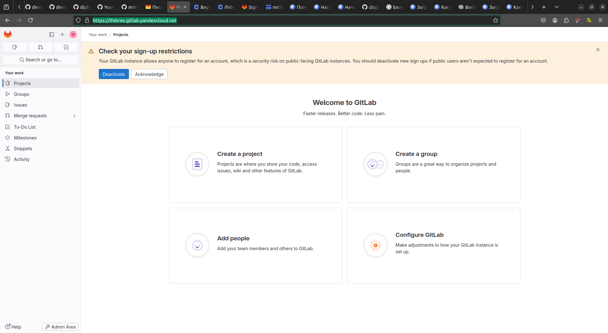

# Дипломный практикум в Yandex.Cloud


---
## Цели:

1. Подготовить облачную инфраструктуру на базе облачного провайдера Яндекс.Облако.
2. Запустить и сконфигурировать Kubernetes кластер.
3. Установить и настроить систему мониторинга.
4. Настроить и автоматизировать сборку тестового приложения с использованием Docker-контейнеров.
5. Настроить CI для автоматической сборки и тестирования.
6. Настроить CD для автоматического развёртывания приложения.

---
## Этапы выполнения:
1. Создание облачной инфраструктуры
2. Создание Kubernetes кластера
3. Создание тестового приложения
4. Подготовка cистемы мониторинга и деплой приложения
5. Установка и настройка CI/CD
6. Настройка CI/CD Terraform

---

## Описание этапов 

### Создание облачной инфраструктуры

Подготовка инфраструктуры с использованием terraform ([конфигурационные файлы](terraform))   
Для удобства создан файл [deploy.sh](deploy.sh) - создаёт сервисный аккаунт, бакет, бэкэнд и запускает создание инфраструктуры


---

### Создание Kubernetes кластера

#### Установка Kubernetes кластера на ВМ.  
   Для установки кластера будет использован [Kubespray](https://kubernetes.io/docs/setup/production-environment/tools/kubespray/). Заполняем файл  [hosts.yaml](ansible%2Fhosts.yaml) на основании адресов созданной инфраструктуры. 
   В файле [k8s-cluster.yml](ansible%2Fgroup_vars%2Fk8s_cluster%2Fk8s-cluster.yml) выставляем параметр ```kubeconfig_localhost: true``` для сохранения kubeconfig в каталог ```./artifacts ``` 
   Запускаем создание кластера используя [hosts.yaml](ansible%2Fhosts.yaml) в качестве inventory файла. По завершении установки копируем содержимое файла ```./artifacts/admin.conf``` в файл ```~/.kube/config```, проверяем подключение к кластеру
    

  

---
### Создание тестового приложения

   Создадим отдельный git репозиторий с простым nginx конфигом https://github.com/Hovard777/diplom-app.  
   Подготовим Dockerfile для создания образа приложения. 
   Отправим образ в https://hub.docker.com/  


---
### Подготовка cистемы мониторинга и деплой приложения

Задеплоил систему мониторинга, используя пакет ```kube-prometheus```. 
Для настройки доступа к Grafana сконфигурируем service [grafana-service.yaml](monitoring%2Fmanifests%2Fgrafana-service.yaml) и [grafana-networkPolicy.yaml](monitoring%2Fmanifests%2Fgrafana-networkPolicy.yaml)  
Ссылка на Grafana http://158.160.33.137:31000/d/efa86fd1d0c121a26444b636a3f509a8/kubernetes-compute-resources-cluster?orgId=1&refresh=10s  
Доступ admin/admin


Используя манифест [app.yaml](app%2Fapp.yaml), задеплоил приложение. ```kubectl apply -f  app.yaml```
Ссылка на приложение http://158.160.33.137:30082/  


---
### Установка и настройка CI/CD

Воспользуемся Yandex Managed Service for GitLab. Интерфейс доступен по адресу https://ifebres.gitlab.yandexcloud.net/

Создадим проект ```diplom-app``` https://ifebres.gitlab.yandexcloud.net/ifebres/diplom-app  
Gitlab Runner задеплоим в Kubernetes при помощи helm, используя  [runner.yaml](cicd%2Frunner.yaml)  
CI/CD настроим в Gitlab, используя конфиг [gitlab-ci.yaml](cicd%2Fgitlab-ci.yaml)  
Для взаимодействия с dockerhub выпустим токен и добавим в Gitlab.  
Для взаимодействия с k8s добавим в переменную ```KUBECONFIG``` содержимое файла ```~./kube/config``` и выставим тип File.  
При любом коммите собирается новый образ, отправляется в репозиторий и деплоится в k8s.  


---

### Настройка CI/CD Terraform
Для настройки CI/CD используется Gitlab.
Создан отдельный репозиторий ```diplom-tf``` https://ifebres.gitlab.yandexcloud.net/ifebres/diplom-tf
В нём размещены файлы terraform и [.gitlab-ci.yml](terraform%2F.gitlab-ci.yml)
В переменные добавлены ```access file, access_key, secret_key```
При любом коммите происходит валидация terraform, затем terraform plan с подготовкой файла для выполнеия terraform apply.
Применение изменений происходит по кнопке.


---
Доп материалы  
CI/CD:
- https://yandex.cloud/ru/docs/tutorials/infrastructure-management/gitlab-containers?utm_referrer=https%3A%2F%2Fwww.google.com%2F
- https://cloud.vk.com/blog/launching-a-project-in-kubernetes
- https://cloud.vk.com/blog/proekt-na-kubernetes-v-mailru-cloud-solutions-chast-3
- https://cloud.vk.com/docs/cases/cases-gitlab/case-k8s-app
- https://gitlab.com/nhsbsa/platform-services/pipeline-templates/kaniko/-/blob/main/kaniko-job.gitlab-ci.yml?ref_type=heads
CI/CD Terraform:
- https://www.youtube.com/watch?v=U58zSIvgyDI

