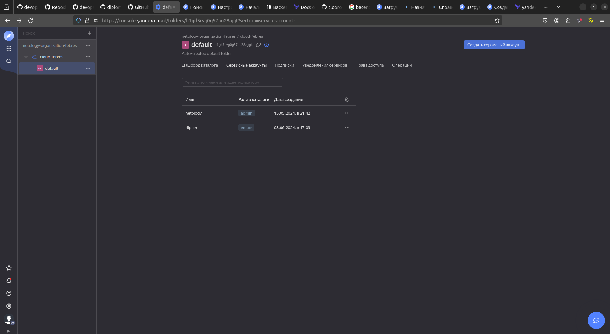

1. export YC_TOKEN=$(yc iam create-token) - добавим/обновим токен для работы с yc
2. создал sa с ролью editor 
3.   
```commandline
yc iam key create --service-account-id ajeldh2taangr56he145 --folder-name default --output ~/sa_key.json
id: ajeh4f9rc8gvtg7jabrs
service_account_id: ajeldh2taangr56he145
created_at: "2024-06-03T14:15:57.918164092Z"
key_algorithm: RSA_2048
```
4.  
```commandline
yc iam service-account list
+----------------------+----------+
|          ID          |   NAME   |
+----------------------+----------+
| ajefigqpurd6ef7v68hg | netology |
| ajeldh2taangr56he145 | diplom   |
+----------------------+----------+
```
5. Создание статических ключей доступа
```commandline
ifebres@ifebres-nb:~/github/devops-diplom-yandexcloud/terraform$ yc iam access-key create --service-account-name diplom
access_key:
  id: ajej4pmlftm33pij2elv
  service_account_id: ajeldh2taangr56he145
  created_at: "2024-06-03T14:20:52.788528802Z"
  key_id: YCAJEPX6cKGURznZ8hyMU2mU_
secret: YCNKnrhyYmCvNGzfd7vW7xv5dweziG64WSst5NHp
```
6. В папке с конфигурационным файлом выполните команду:
```commandline
terraform init -backend-config="access_key=$ACCESS_KEY" -backend-config="secret_key=$SECRET_KEY"
```
вылезла ошибка 
```
ifebres@ifebres-nb:~/github/devops-diplom-yandexcloud/terraform$ terraform init -backend-config="access_key=YCAJEPX6cKGURznZ8hyMU2mU_" -backend-config="secret_key=YCNKnrhyYmCvNGzfd7vW7xv5dweziG64WSst5NHp"

Initializing the backend...

Successfully configured the backend "s3"! Terraform will automatically
use this backend unless the backend configuration changes.
Error refreshing state: Unable to access object "tf-state/main.tfstate" in S3 bucket "diplom-bucket": operation error S3: HeadObject, https response error StatusCode: 403, RequestID: 45e4a9401a4ed6b8, HostID: , api error Forbidden: Forbidden
```
перенёс ключи в конфиг и создал профиль для аккаунта
```commandline
ifebres@ifebres-nb:~/github/devops-diplom-yandexcloud/terraform$ yc config profile list 
default
netology-svc-profile ACTIVE
ifebres@ifebres-nb:~/github/devops-diplom-yandexcloud/terraform$ yc config profile create diplom
Profile 'diplom' created and activated
ifebres@ifebres-nb:~/github/devops-diplom-yandexcloud/terraform$ yc config set service-account-key ~/sa_key.json 
ifebres@ifebres-nb:~/github/devops-diplom-yandexcloud/terraform$ yc config set cloud-id b1grtmm0e3bfv2rf4kiq
ifebres@ifebres-nb:~/github/devops-diplom-yandexcloud/terraform$ yc config set folder-id b1gd5rvg0g57hu28ajgt
```
7. Как оказалось. надо сменгить версию тераформа на 1.5.х и перед запуском инициализации создать бакет командой
```commandline
ifebres@ifebres-nb:~/github/devops-diplom-yandexcloud/terraform$ yc storage bucket create --name ifebres-state-bucket
name: ifebres-state-bucket
folder_id: b1gd5rvg0g57hu28ajgt
anonymous_access_flags:
  read: false
  list: false
default_storage_class: STANDARD
versioning: VERSIONING_DISABLED
acl: {}
created_at: "2024-06-03T17:14:59.473294Z"

```